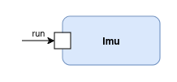

# 4.1 Introduction

[Back to the main menu](../README.md)

The IMU is an F´ passive component that collects data from the MPU6050 6-DoF Accelerometer and Gyro.

## Introduction to MPU6050

### Hardware Overview

I2C interface: The sensor reports data via an I2C interface.

**Power management:**
The MPU6050 has several power modes. In order for the sensor to begin collecting
data it needs to be "awakened" by the entry of 0 at the "Power Management 1" register at
address 0x6B. 

**Accelerometer:**
Hardware registers 0x3B through 0x40 store the most recent accelerometer measurement
as a triple of coordinates (x, y, z) in units of g (gravitational acceleration).
The full scale range of the digital output from the accelerometer can be set to ±2g, ±4g, ±8g, or ±16g.
Each coordinate is stored as a scaled 16-bit signed integer.

**Gyroscope:**
Hardware registers 0x43 through 0x48 store the most recent gyroscope measurement
as a triple of coordinates (x, y, z) in units of deg/s (degrees per second).
The gyro sensors may be digitally programmed to ±250, ±500, ±1000, or ±2000/s.
Each coordinate is stored as a scaled 16-bit signed integer.

**Data sheet:** For more details, see the [manufacturer's data sheet](https://invensense.tdk.com/wp-content/uploads/2015/02/MPU-6000-Datasheet1.pdf).

### Arduino Library

In the setup we installed the `FastIMU` library which is essential for development of the IMU Component. The source code of library can be found in [FastIMU git repo](https://github.com/LiquidCGS/FastIMU).

From there we can speculate an example like [Calibrated_sensor_output](https://github.com/LiquidCGS/FastIMU/blob/main/examples/Calibrated_sensor_output/Calibrated_sensor_output.ino). This file has a `.ino` extention which is known for the Arduino-based projects. A good practice is to firstly run the example to see its results and then try to do the same in the fprime project.

You can also find a simpler version in [read_accelereration_arduino/read_accelereration_arduino.ino](../read_accelereration_arduino/read_accelereration_arduino.ino)

## Requirements

In the process of this tutorial we will have to satisfy the given requirements.

### IMU Component
| Requirement ID | Description | 
|----------------|-------------|
| Components-IMU-1 | The Components::Imu component shall power on from the beginning. | 
| Component-IMU-2 | The Components::Imu component shall be able to communicate with the MPU6050 over I2C. 
| Components-IMU-3 | The Components::Imu component shall be able to produce telemetry and events for the MPU's I2C status. 
| Components-IMU-4 | The Components::Imu component shall produce telemetry of accelerometer data at 100Hz. | 
| Components-IMU-5 | The Components::Imu component shall transmit data to other components from output port. |

## Component Design

In image above we can see the Component Diagram. What we can see is that the component has a `run` [rate group](https://nasa.github.io/fprime/UsersGuide/best/rate-group.html) input port to control the timing of the data acquisition from the IMU and a `MPU_data` output port to get the data from the component.

---

**Next**: [Defining Ports and Types](./ports_types.md)  